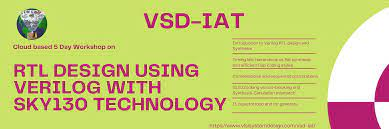

# SKY130_RTL_Design_and_Synthesis_Workshop
VSD Workshop on RTL Design using Verilog HDL and Synthesis using SKY130 Technology

# Table of Contents
- [1. Project Scope](#1-project-scope)
- [2. Prerequisites](#2-prerequisites)
- [3. Day 1 - Introduction to Verilog RTL design and Synthesis](#2-day-1---introduction-to-verilog-rtl-design-and-synthesis)
  - [2.1. Introduction to Simulation](#21-introduction-to-simulation)
    - [2.1.1. Simulation results](#211-simulation-results)
  - [2.2. Introduction to Synthesis](#22-introduction-to-synthesis)
    - [2.2.1. Yosys synthesizer flow](#221-yosys-synthesizer-flow)
      - [2.2.1.1. Read RTL design](#2211-read-rtl-design)
      - [2.2.1.2. Generic synthesis](#2212-generic-synthesis)
      - [2.2.1.3. Read Sky130 cell library](#2213-read-sky130-cell-library)
      - [2.2.1.4. Generate netlist](#2214-generate-netlist)
      - [2.2.1.5. Show](#2215-show)

# 1. Project Scope
  This is a 5-day workshop from VSD-IAT on RTL design and synthesis using open source silicon toolchains involving iVerilog, GTKWave, Yosys with Sky130 technology.  

  - The SkyWater Open Source PDK is a collaboration between Google and SkyWater Technology Foundry to provide a fully open source Process Design Kit and related  resources, which can be used to create manufacturable designs at SkyWater’s facility.
    The SkyWater Open Source PDK documentation can be found at <https://skywater-pdk.rtfd.io>.
  - iverilog - Iverilog stands for Icarus verilog, is an open source verilog simulator.
  - GTKWave - GTKWave is an open-source vcd(value change dump) waveform viewer.
  - Yosys - Yosys is an open-source synthesis tool. These are the open-source tools used in the labs for the workshop.

This particular workshop covers the various aspects of design in Verilog HDL both theoretically and practically with labs using open-source softwares through their VSD-IAT portal. Beginning with an introduction to digital design using Verilog HDL,it cover digital design steps that include design, functional simulation, test bench based validation of the design functionality and logic Synthesis with optimization.

# 2. Prerequisites
  - Require a Linux based OS and a host of open source EDA tools.
  - Basic knowledge of Verilog HDL is required for better understanding.

