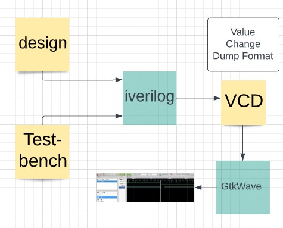

# SKY130_RTL_Design_and_Synthesis_Workshop
VSD Workshop on RTL Design using Verilog HDL and Synthesis using SKY130 Technology

# Table of Contents
- [1. Project Scope](#1-project-scope)
- [2. Prerequisites](#2-prerequisites)
- [3. Day 1 - Introduction to Verilog RTL design and Synthesis](#3-day-1---introduction-to-verilog-rtl-design-and-synthesis)
  - [3.1. Brief Principles of Operation](#31-brief-principles-of-operation)
  - [3.2. Introduction to Lab Session](#32-introduction-to-lab-session)
    - [2.2.1. Yosys synthesizer flow](#221-yosys-synthesizer-flow)
      - [2.2.1.1. Read RTL design](#2211-read-rtl-design)
      - [2.2.1.2. Generic synthesis](#2212-generic-synthesis)
      - [2.2.1.3. Read Sky130 cell library](#2213-read-sky130-cell-library)
      - [2.2.1.4. Generate netlist](#2214-generate-netlist)
      - [2.2.1.5. Show](#2215-show)

# 1. Project Scope
  This is a 5-day workshop from VSD-IAT on RTL design and synthesis using open source silicon toolchains involving iVerilog, GTKWave, Yosys with Sky130 technology.  

  - The SkyWater Open Source PDK is a collaboration between Google and SkyWater Technology Foundry to provide a fully open source Process Design Kit and related  resources, which can be used to create manufacturable designs at SkyWater’s facility.
    The SkyWater Open Source PDK documentation can be found at <https://skywater-pdk.rtfd.io>.
  - iverilog - Iverilog stands for Icarus verilog, is an open source verilog simulator.
  - GTKWave - GTKWave is an open-source vcd(value change dump) waveform viewer.
  - Yosys - Yosys is an open-source synthesis tool. These are the open-source tools used in the labs for the workshop.

This particular workshop covers the various aspects of design in Verilog HDL both theoretically and practically with labs using open-source softwares through their VSD-IAT portal. Beginning with an introduction to digital design using Verilog HDL,it cover digital design steps that include design, functional simulation, test bench based validation of the design functionality and logic Synthesis with optimization.

# 2. Prerequisites
  - Require a Linux based OS and a host of open source EDA tools.
  - Basic knowledge of Verilog HDL is required for better understanding.

# 3. Day 1 - Introduction to Verilog RTL design and Synthesis
## 3.1. Brief Principles of Operation

**Simulation**:
     It is technique for applying different input stimulus to the design at different times to check if the RTL code behaves in an intended way. Here we are dealing with Digital design which is modelled using HDL (hardware description language) like VHDL,Verilog,System Verilog.
     
**Simulator**:
     A Simulator is a tool which is used for checking a funtionality of Design.The simulator used here is "iverilog".
     
**RTL Design** :
    RTL design is the implementation based on specs. It is checked for adherence to the spec by the design. The tool used for Simulating the design is a Simulator.  Design is done with verilog code or a set of verilog codes which has intented functionality to meet with the required specfication.
      RTL Design stands for Register Transfer Level. It provides an abstraction of the digital circuit using:
      Combinational logic, Registers, Modules (IP’s or Soft Macros).
      
**Test Bench**:
      It is the Setup to apply stimulus(Test_Vectors) to Design to check it's Functionality.Here the Logical functionality is verified.
      
 
      
    
**Design iverilog and Testbench**:
The RTL design written in verilog code has some primary inputs and primary outputs. It may have one or more primary inputs and one or more corresponding primary outputs.
We need to give stimulus to all the primary inputs and need to observe the primary outputs. Thus we need stimulus generator at the input and stimulus observer at the output.
For giving stimulus we write the test bench, for that the design(module) is instantiated in the test bench, then stimulus is applied.
It is important to note that the test bench doesn't have any primary input and primary output.

The simulation output of iVerilog can be taken as a value change dump ('.vcd') file that could then be visualized in GTKWave.  
[GTKWave](http://gtkwave.sourceforge.net/) is an open source tool for visualizing the signal dumps in .vcd/.lxt formats.

 
 
 **Synthesis**:
 The synthesis tool takes the RTL desgin and the cell library (liberty file) as inputs and translates the RTL into netlist. Hence the netlist is the gate-level representation of the specifiec logic desgin via Verilog HDL in RTL.
 
 ## 3.2. Introduction to Lab Session
 
 - create a directory called VLSI using the terminal.

   *mkdir VLSI
   
 - After creating the VLSI directory, we must git clone some repositories through the given commands. 
   
   *git clone https://github.com/kunalg123/sky130RTLDesignAndSynthesisWorkshop.git

 - After git cloning we can see that two new directories (sky130RTLDesignAndSynthesisWorkshop and vsdflow) have been created in the VLSI directory.It contains various files required for this workshop such as my_lib which contains the library files lib and verilog_model.verilog_files which contains various verilog codes and its testbench files for all the lab expirements.
 
 - We use the command iverilog to load the simulator follwed by the verilog file and testbench name. a.out file is created in the verilog_files folder.
   
   *iverilog good_mux.v tb_good_mux.v
  
 - After creating a.out file we execute it using ./a.out it is going to dump the vcd file.
   
   *./a.out
 
 - Then we write the command to view the waveform for logical verification, run the .vcd file with gtkwave.
 
   *gtkwave tb_good_mux.vcd
  
