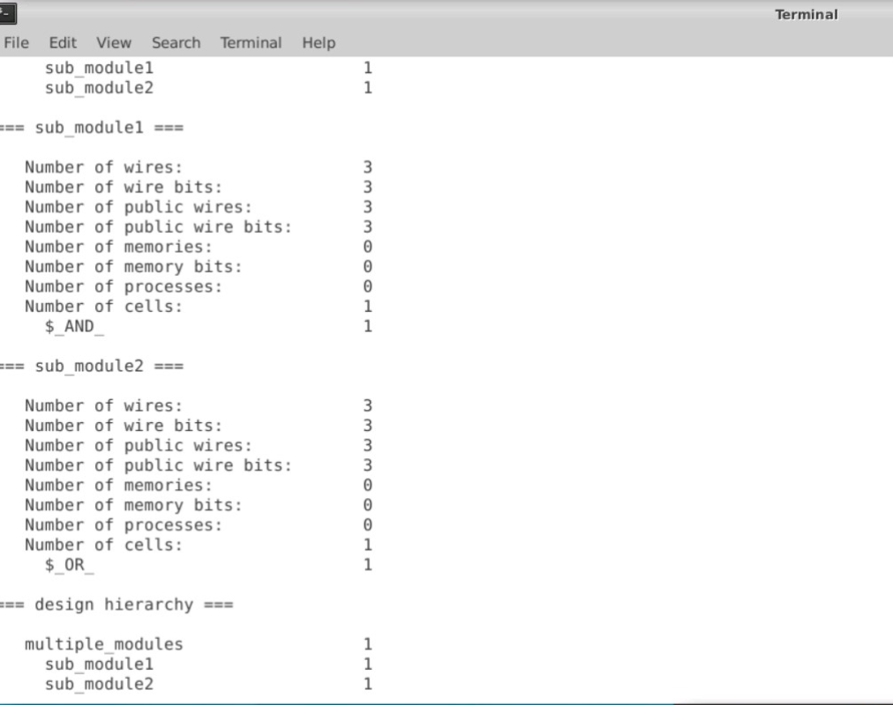

# SKY130_RTL_Design_and_Synthesis_Workshop
VSD Workshop on RTL Design using Verilog HDL and Synthesis using SKY130 Technology

# Table of Contents
- [1. Project Scope](#1-project-scope)
- [2. Day 1 - Introduction to Verilog RTL design and Synthesis](#2-day-1---introduction-to-verilog-rtl-design-and-synthesis)
  - [2.1. Design and Simulation flow](#21-design-and-simulation-flow)
  - [2.2. Introduction to Lab Session](#22-introduction-to-lab-session)
  - [2.3. Logic Synthesis](#23-logic-synthesis)
    - [2.3.1. Introduction to YOSYS](#231-introduction-to-yosys)
    - [2.3.2. To Invoke YOSYS](#232-to-invoke-yosys)
- [3. Day 2 - Timing libs Hierarical vs Flat Synthesis and Efficient Flop Coding Styles](#3-day-2---timing-libs-hierarical-vs-flat-synthesis-and-efficient-flop-coding-styles)
  - [3.1. Introduction to lib](#31-introduction-to-lib)
  - [3.2. Hierarchial vs Flat Synthesis](#32-hierarchial-vs-flat-synthesis)
  - [3.3. Flops and Flop Coding Styles](#33-flops-and-flop-coding-styles)
    - [3.3.1 Glitches](#331-glitches)
    - [3.3.2 Flip Flop Simulation](#332-flip-flop-simulation)
 - [4. Day 3 - Combinational and Sequential Optimizations](#3-day-2---combinational-and-sequential-optimizations)
   - [4.1.Combinational Logic Optimization](#41-combinational-logic-optimization)
   - [4.2.Sequential Logic Optimization](#41-sequential-logic-optimization)
 

# 1. Project Scope
  This is a 5-day workshop from VSD-IAT on RTL design and synthesis using open source silicon toolchains involving iVerilog, GTKWave, Yosys with Sky130 technology.  

  - The SkyWater Open Source PDK is a collaboration between Google and SkyWater Technology Foundry to provide a fully open source Process Design Kit and related  resources, which can be used to create manufacturable designs at SkyWater’s facility.
    The SkyWater Open Source PDK documentation can be found at <https://skywater-pdk.rtfd.io>.
  - iverilog - Iverilog stands for Icarus verilog, is an open source verilog simulator.
  - GTKWave - GTKWave is an open-source vcd(value change dump) waveform viewer.
  - Yosys - Yosys is an open-source synthesis tool. These are the open-source tools used in the labs for the workshop.

This particular workshop covers the various aspects of design in Verilog HDL both theoretically and practically with labs using open-source softwares through their VSD-IAT portal. Beginning with an introduction to digital design using Verilog HDL,it cover digital design steps that include design, functional simulation, test bench based validation of the design functionality and logic Synthesis with optimization.

# 2. Day 1 - Introduction to Verilog RTL design and Synthesis
## 2.1. Design and Simulation flow

**Simulation**:
     It is technique for applying different input stimulus to the design at different times to check if the RTL code behaves in an intended way. Here we are dealing with Digital design which is modelled using HDL (hardware description language) like VHDL,Verilog,System Verilog.
     
**Simulator**:
     A Simulator is a tool which is used for checking a funtionality of Design.The simulator used here is "iverilog".
     
**RTL Design** :
    RTL design is the implementation based on specs. It is checked for adherence to the spec by the design. The tool used for Simulating the design is a Simulator.  Design is done with verilog code or a set of verilog codes which has intented functionality to meet with the required specfication.
      RTL Design stands for Register Transfer Level. It provides an abstraction of the digital circuit using:
      Combinational logic, Registers, Modules (IP’s or Soft Macros).
      
**Test Bench**:
      It is the Setup to apply stimulus(Test_Vectors) to Design to check it's Functionality.Here the Logical functionality is verified.
      
 
      
    
**Design iverilog and Testbench**:
The RTL design written in verilog code has some primary inputs and primary outputs. It may have one or more primary inputs and one or more corresponding primary outputs.
We need to give stimulus to all the primary inputs and need to observe the primary outputs. Thus we need stimulus generator at the input and stimulus observer at the output.
For giving stimulus we write the test bench, for that the design(module) is instantiated in the test bench, then stimulus is applied.
It is important to note that the test bench doesn't have any primary input and primary output.

The simulation output of iVerilog can be taken as a value change dump ('.vcd') file that could then be visualized in GTKWave.  
[GTKWave](http://gtkwave.sourceforge.net/) is an open source tool for visualizing the signal dumps in .vcd/.lxt formats.

 
 
 **Synthesis**:
 The synthesis tool takes the RTL desgin and the cell library (liberty file) as inputs and translates the RTL into netlist. Hence the netlist is the gate-level representation of the specifiec logic desgin via Verilog HDL in RTL.
 
 ## 2.2. Introduction to Lab Session
 
 - create a directory called VLSI using the terminal.

   *mkdir VLSI
   
 - After creating the VLSI directory, we must git clone some repositories through the given commands. 
   
   *git clone https://github.com/kunalg123/sky130RTLDesignAndSynthesisWorkshop.git

 - After git cloning we can see that two new directories (sky130RTLDesignAndSynthesisWorkshop and vsdflow) have been created in the VLSI directory.It contains various files required for this workshop such as my_lib which contains the library files lib and verilog_model.verilog_files which contains various verilog codes and its testbench files for all the lab expirements.
 
 - We use the command iverilog to load the simulator follwed by the verilog file and testbench name. a.out file is created in the verilog_files folder.
   
   *iverilog good_mux.v tb_good_mux.v
  
 - After creating a.out file we execute it using ./a.out it is going to dump the vcd file.
   
   *./a.out
 
 - Then we write the command to view the waveform for logical verification, run the .vcd file with gtkwave.
 
   *gtkwave tb_good_mux.vcd
  

                          commands in terminal for opening GTKWAVE

                          waveform pattern for good_mux.v
  
  - To view the verilog code  
  
    *gvim <verilog_file.v>
    
    
    
    Now a editor will be opened displaying the verilog testbench code for good_mux.v
  
  ## 2.3. Logic Synthesis
  ### 2.3.1 Introduction to YOSYS
  
  **Synthesis** is the process of conversion of RTL to Gate Level Translation. The design is converted into gates and the connections are made between the gates. This is given out as a file called Netlist. 
  
  **Synthesizer** is a tool for the conversion of RTL Design to Netlist. For this workshop, we are going to use the open-source synthesizer, Yosys. When .lib and Design files are applied to the Yosys, Netlist of the design is resulted output file.
  
   
  
Note: Stimulus provided must be same as output observed during RTL design simulation. We can use the same testbench which we used for the RTL design simulation.

**.lib**   
- contains collection of logical modules
- Include basic logic gates
- Different flavours of same gate like 3 input AND gate have(slow, medium, fast) types are there

**Why Different Flavours of Gate Required?**

As the combinational delay in the logic path determines the maximum speed of operation of digital logic circuit i.e

Tclk > TCQ_A + Tcombi+TSetup_B            we need cells to work fast.

And to ensure that there is no hold issue in the next flop we need slow cell and as hold time is given by

THold_B < TCQ_A + Tcombi                  we need cell that work slowly.

We need cells that work fast to meet performance and cells that work slow to meet Hold time. So we need different flavours of gate to meet this requirement.The Collection forms .lib.

**Note**:

Load in Digital Logic Circuit --> Capacitance
Faster the charging/discharging --> Lesser the cell delay

To Charge/Discharge the capacitance fast, we need Transistors capable of sourcing more current.
Wider Transistor --> Low Delay --> More Area and Power.

**Selection of Cells**

- Need to guide the synthesizer to select he cells that are optimum for implementation of logic design.
- More use of Faster cells results in bad circuit in terms of area and power and also might voilet the Hold time.
- More use of slower cells results in sluggish circuit.
- The Guidance given to the synthesizer is known as 'contraints'.

 ### 2.3.2 To Invoke YOSYS
  
  - Before invoking yosys we must in the directory verilog_file. To invoke yosys, just type yosys
   
     *yosys
   
     
   
   - to read the library.

     *yosys> read_liberty -lib ../my_lib/lib/sky130_fd_sc_hd__tt_025C_1v80.lib
   
   - lets read a verilog file (mux_generate.v) by using the command,

     *read_verilog mux_generate.v
   
   - Now to synthesize the good_mux module, the command is

     *synth -top good_mux
   
     
     
     here we can see the no of cells thate generate for this file synthesis
   
   - To generate the netlist, the command is

     *abc -liberty ../my_lib/lib/sky130_fd_sc_hd__tt_025C_1v80.lib
    
     
     
      we can see that the RTL design is converted into the standard cell design from the library file we mentioned in the command. Now if we look a little close we can see that it has shown the input and output signals.
     
     - Now if we want to see the logic realized by the circuit, type show
       
       *show
     
      
      
      
     -  To get the netlist, write the command
      
       *write_verilog good_mux_netlist.v
       
     - To open the netlist,

       *!gvim good_mux_netlist.v
       
       
       
     - To get a even more simplified netlist, the command is

       *write_verilog -noattr good_mux_netlist.v
       
     -  the simplified netlist can be viewed by
      
        *!gvim good_mux_netlist.v
         
       
 
       In the Logic Circuit generated we can observe

       - nand2_1 --> 2 input Nand gate
       - o21ai_0 --> or and inverter
       - clkinv_1 --> inverter

 # 3. Day 2 - Timing libs Hierarical vs Flat Synthesis and Efficient Flop Coding Styles
 ## 3.1 Introduction to lib

 We have used **sky130_fd_sc_hd__tt_025C_1v80**; meaning of each abbreviation is given below:

  - fd - the skywater foundary
  - sc - digital standard cell
  - hd - high density
  - tt - typical process
  - 025C - temperature
  - 1v80 - voltage
 
 -- We already know about .lib, but now lets look what it looks like in an editor. After going to the verilog_files directory, type

   *gvim ../my_lib/lib/sky130_fd_sc_hd__tt_025C_1v80.lib
  
  
  
  
   Some of the details which are provided in the .lib file are
     - power, area, capacitance, timings, pin details

 Now for better understanding in comparison, let us take the three flavours of the same cell **2 input AND**.

 
 
 ## 3.2 Hierarchial vs Flat Synthesis
 
 - The file we are going to synthesize is multiple_modules. Lets open it by 
 
   *gvim multiple-modules.v
 
  
 
 This is the multiple_modules.v file with two sub modules (OR and AND ), the main module instantiates the both modules within it. Now let us synthesis the file using yosys
 
 
  
 
 We can see the modules itself inside the multiple_modules instance instead of the AND and OR gates. Here the hierarchies are preserved, so it is called as Hierarchial design. Now let us look the netlist generated from this design,

   *write_verilog -noattr multiple_modules_hier.v

   *!gvim multiple_modules_hier.v
 
  
 
 - Now lets generate a flat netlist using the commands
 
   *flatten
 
   *write_verilog multiple_modules_flat.v
 
   *!gvim multiple_modules_flat.v
 
 - Now for comparison of both synthesis, use:
  
    *vsp 
 
  
  
  
  ## 3.3 Flops and Flop Coding Styles
  ### 3.3.1 Glitches
  
   
  
   - More are the combinational circuits more the glitches will be.
   - To remove the glitches we require storage elements, these elements are **Flip Flops**.
   - FF output will change only at clock edges.
  
  ### 3.3.2 Flip Flop Simulation
  
   Let us observe and simulate the flop styles. First lets simulate the file dff_asyncres.v using iVerilog,
  
   *iverilog dff_asyncres.v tb_dff_asyncres.v

   *./a.out
   
   *gtkwave tb_dff_asyncres.vcd

   
   
   Now let us synthesis the ff design using yosys,
   
   
   
   
  # 4. Day 3 - Combinational and Sequential Optimizations 
  ## 4.1 Combinational Logic Optimization
   We need combinational logic optimisation to squeeze the logic to get the most optimised design.
   
   - Mainly for Area and Power Saving
   - Constant Propogation is one of the technique used for Combinational Logic Optimisation
        It is a Direct Optimisation in which the value of one input is propogated to the next stage to get the most optimised logic.       
   - Another Technique Used is the Boolean Logic Optimisation in which we use and other tools to get the most optimised logic.
   
      *gvim opt_check.v
   
      *read_liberty -lib ../my_lib/lib/sky130_fd_sc_hd__tt_025C_1v80.lib
   
      *read_verilog opt_check.v
   
      *synth -top opt_check
   
   - The command for the constant propagation and optimization

      *opt_clean -purge
      
      *abc -liberty ../my_lib/lib/sky130_fd_sc_hd__tt_025C_1v80.lib
      
      *show
      
      
      
       we can see that after synthesis it has been optimized to an AND gate.
      
      ## 4.2 Sequential Logic Optimization
      
       **Sequential Constant Propogation**:
         - Some of the Sequential design in which D input is tied off the Squential Constant is propogated to give Q pin as a Constant and gives the most optmised design of the Squential Circuits.
         - The Sequential Design in which Q does not remains as constant cannot be optimised and flop needs to be retained in the circuit.

      
      
      
      
      
   
   
